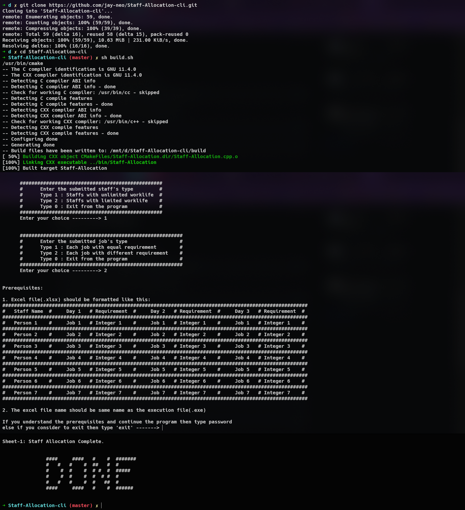
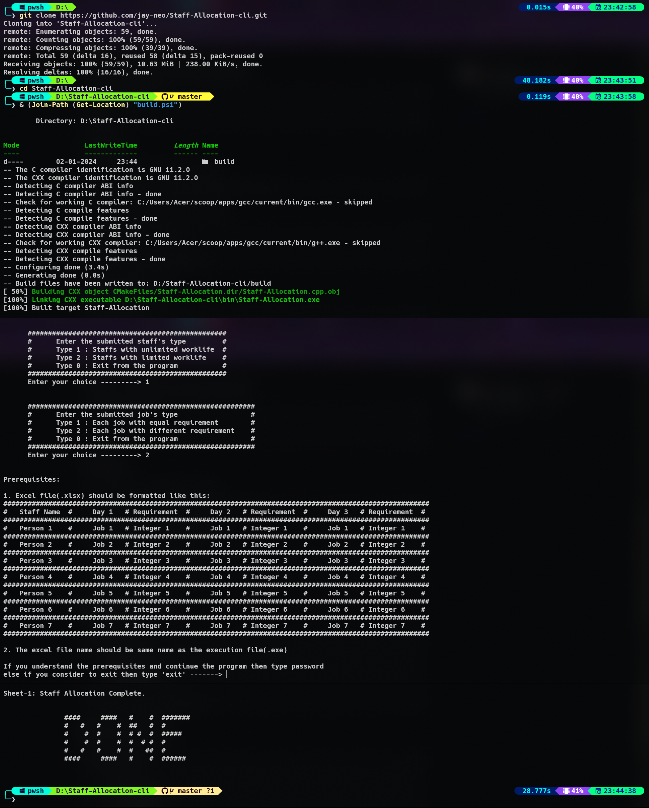

 <div align='center'><h1>Staff Allocation</h1></div>

## Problem Statement

Uneven task distribution among staff members is impacting productivity and job satisfaction. The need for an automated system arises to minimize successively assigned tasks for each staff member. The goal is to optimize workforce efficiency while maintaining a fair and equitable task allocation process.

### Constraints

1. Staff members have varying workload capacities
2. Equitable task distribution as Workload Balancing
3. Each job may have varying requirement

Example: Teacher Allocation in Examination Rooms

Here Freemium libxl is used, so this program can read maximum 300 cells from the input file.
New Repository: [For CSV File](https://github.com/jay-neo/Staff-Allocation)


## How to Test the Program

### For Linux

- Step 1: Clone the repo in your local machine
```sh
git clone https://github.com/jay-neo/Staff-Allocation-cli.git
```

- Step 2: Run two commands in terminal (bash/zsh/fish)
```sh
cd Staff-Allocation-cli
```
```sh
sh build.sh
```

<div align='center'></div>


### For Windows

- Step 1: Clone the repo in your local machine
```sh
git clone https://github.com/jay-neo/Staff-Allocation-cli.git
```

- Step 2: Run two commands in terminal (pwsh)
```sh
cd Staff-Allocation-cli
```
```sh
& (Join-Path (Get-Location) "build.ps1")
```

<div align='center'></div>


## Repository Structure
```
Staff-Allocation-cli
    │
    ├── libxl/
    │    ├── include_cpp/
    │    │       └── libxl.h (with other libxl header files)
    │    └─── lib64/
    │           ├── libxl.so
    │           └── libxl.dll
    │
    ├── CMakeLists.txt
    ├── Staff-Allocation.cpp
    │
    └── Staff-Allocation.xlsx // This is the input file

```
